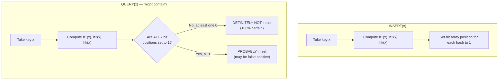
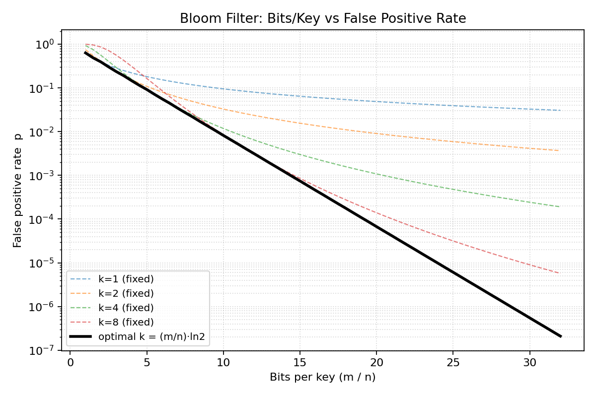

# Bloom Filters: How They Work, the Sizing Math, and Where They're Used

A **Bloom filter** is a probabilistic data structure used to test whether an element is a member of a set. It trades a small, tunable chance of **false positives** for massive savings in space and O(1)-ish time — and it *never* produces a false negative.

> **One-line definition:** "Is this element **definitely not** in the set, or **possibly** in the set?" — that's the only question a Bloom filter answers.

---

## 1. How It Works

A Bloom filter is just:
- A bit array of size **m** (initialized to all 0s)
- **k** independent hash functions, each mapping a key to a position in `[0, m-1]`

### Insert(x)
Hash `x` with all `k` hash functions and set each resulting bit position to `1`.

### Query(x) — "Might Contain"
Hash `x` with all `k` hash functions and check those bit positions:
- If **any** bit is `0` → `x` is **definitely not** in the set.
- If **all** bits are `1` → `x` is **probably** in the set (could be a false positive caused by hash collisions from *other* keys).



### Visualizing the bit array

```
Bit array (m = 16), k = 3 hash functions

Insert "cat"  -> hashes to bits 1, 4, 13
Insert "dog"  -> hashes to bits 3, 4, 9

index:  0  1  2  3  4  5  6  7  8  9 10 11 12 13 14 15
bits:   0  1  0  1  1  0  0  0  0  1  0  0  0  1  0  0
              ^        ^           ^           ^
            dog      shared      dog        cat
                    (cat & dog)

Query "cat"  -> checks bits 1, 4, 13 -> all 1 -> "probably present" (correct)
Query "fox"  -> checks bits 1, 9, 15 -> bit 15 is 0 -> "definitely absent" (correct)
Query "owl"  -> checks bits 3, 4, 13 -> all 1, but "owl" was never inserted
                -> FALSE POSITIVE (collision of bits from cat + dog)
```

This is exactly why false positives happen: the bit array is *shared* across all inserted keys, so an unrelated key can accidentally land on bits that were set by other keys.

---

## 2. The Sizing Math: Bits/Key vs. False-Positive Rate

There are three variables you're always juggling:

| Symbol | Meaning |
|---|---|
| **n** | Number of keys you plan to insert |
| **m** | Size of the bit array, in bits |
| **k** | Number of hash functions |
| **p** | Target false-positive rate |

### The false-positive probability formula

After inserting `n` keys with `k` hash functions into an `m`-bit array, the probability that a given bit is still `0` is approximately `e^(-kn/m)`. So the probability a query returns a false positive (all `k` of its bits happen to be `1`) is:

```
p ≈ (1 − e^(−kn/m))^k
```

### The optimal number of hash functions

For a fixed `m/n` (bits per key), the value of `k` that **minimizes** `p` is:

```
k_optimal = (m/n) · ln(2)   ≈   0.693 · (m/n)
```

Using too few hash functions under-utilizes the bit array (bits stay 0 too often, but each query is loose); using too many saturates it with 1s too fast. There's a sweet spot, and it scales linearly with bits/key.

### Bits/key needed for a target false-positive rate

Rearranging, if you know the FPR `p` you're willing to tolerate, the bits-per-key you need is:

```
m/n = −(ln p) / (ln 2)²   ≈   1.44 · log2(1/p)
```

**This is the single most useful formula in practice** — it tells you memory cost as a direct function of your accuracy requirement, independent of how many keys you have (it's a *ratio*, so it scales linearly with `n`).

### Sizing table (using optimal k)

| Bits/key (m/n) | Optimal k | False-positive rate | Roughly |
|---:|---:|---:|---|
| 4  | 3  | 0.1469   | 1 in 7 |
| 6  | 4  | 0.0561   | 1 in 18 |
| 8  | 6  | 0.0216   | 1 in 46 |
| 10 | 7  | 0.0082   | 1 in 122 |
| 12 | 8  | 0.0031   | 1 in 318 |
| 14 | 10 | 0.0012   | 1 in 833 |
| 16 | 11 | 0.00046  | 1 in 2,180 |
| 18 | 12 | 0.00018  | 1 in 5,677 |
| 20 | 14 | 0.00007  | 1 in 14,895 |
| 24 | 17 | 0.00001  | 1 in 101,641 |
| 28 | 19 | 0.000001 | 1 in 694,420 |
| 32 | 22 | ~0       | 1 in 4,752,501 |

**Rule of thumb:** ~10 bits/key with 7 hash functions gets you under 1% false positives. That's roughly **1.2 bytes per key**, regardless of how large or small the keys themselves are — this is the core value proposition.

### Bits/key vs. false-positive rate (chart)



The dashed lines show what happens if you *fix* `k` and only vary bits/key — each one flattens out because a suboptimal (too-low or too-high) `k` wastes bits at higher m/n. The solid black line — where `k` is re-optimized at every point via `k = (m/n)·ln2` — keeps dropping, because you're always using the best possible `k` for that memory budget.

### Reverse-engineering m and k for a real design

Given a target `n` keys and target FPR `p`:

1. `m = n · (−ln p) / (ln 2)²` → total bits needed
2. `k = (m/n) · ln 2` → round to nearest integer
3. Recompute actual `p` with the rounded `k` (since `k` must be an integer, actual FPR is usually a bit better than the target)

**Example:** You expect `n = 10,000,000` keys and want `p ≤ 0.1%` (0.001):
- `m/n ≈ 14.38` bits/key → `m ≈ 143.8 million bits ≈ 17.97 MB`
- `k = round(14.38 × 0.693) ≈ 10` hash functions
- Compare: storing the raw keys (say, 20-byte UUIDs) would cost `10,000,000 × 20 bytes = 190.7 MB` — the Bloom filter is **~10x smaller** while still filtering >99.9% of non-members.

---

## 3. Pros

- **Extremely space-efficient** — independent of key size; ~10-20 bits/key regardless of whether keys are 8 bytes or 8 KB.
- **O(k) constant-time** insert and lookup, regardless of how many elements are in the set.
- **No false negatives** — if it says "not present," that's a guarantee, which is exactly the property needed to safely *skip* expensive work (disk seeks, network calls, cache misses).
- **Mergeable** — two Bloom filters of the same size (m) and same hash functions can be combined with a bitwise `OR` to get the filter for the union of their sets. This makes them naturally parallelizable across shards/partitions.
- **Privacy-friendlier** than a plain list — the bit array doesn't directly reveal the actual keys stored.

## 4. Cons

- **False positives are inherent** — the whole structure is a probability/memory trade-off; you can shrink the rate but never eliminate it (short of using `k` and `m` so large it stops being efficient).
- **No deletion** in the classic design — clearing a bit to "remove" a key might also unset a bit that another key depends on, silently turning that key into a false negative (which breaks the core guarantee). Deletion requires a variant (see below).
- **No enumeration** — you cannot retrieve the list of elements that were inserted; it only answers membership queries.
- **Must be sized upfront** — you need a reasonable estimate of `n` ahead of time. Under-provisioning `m` causes the false-positive rate to climb as more keys are inserted than planned; the array itself doesn't grow.
- **Not naturally resizable** — growing capacity generally means building a new, larger filter and reinserting all keys (or chaining filters — see Scalable Bloom Filters).

## 5. Common Variants (brief)

- **Counting Bloom Filter** — replaces each bit with a small counter (e.g., 4 bits), so deletion is possible by decrementing instead of clearing.
- **Scalable Bloom Filter** — starts small and adds new filter "layers" as it fills up, so you don't need to know `n` in advance.
- **Blocked/Cache-Sectorized Bloom Filter** — restructures bits into cache-line-sized blocks to reduce memory-access latency at the cost of a slightly worse false-positive rate for the same size.
- **Cuckoo Filter** — a different structure (based on cuckoo hashing of fingerprints) that supports deletion and often has better space/performance trade-offs at low target false-positive rates.

---

## 6. Where Bloom Filters Are Used

| Domain | How it's used |
|---|---|
| **LSM-tree storage engines** (Cassandra, HBase, RocksDB, LevelDB, ScyllaDB) | Each on-disk SSTable/segment keeps a Bloom filter of its keys, so a `GET` for a missing key can skip the disk read entirely instead of doing an I/O just to find nothing. |
| **Distributed query engines** (Trino/Presto, Spark, Impala) | Used for **dynamic filtering / semi-join pushdown** — a Bloom filter built from the smaller side of a join is pushed down to the scan of the larger side, letting the engine skip rows/partitions/files that can't possibly match, before they're ever shuffled across the network. |
| **CDNs and web caches** | "One-hit wonder" filtering — track which URLs have been seen once before caching them, avoiding cache pollution from content that's requested only a single time. |
| **Web crawlers** | Track URLs already visited/queued without storing every URL in memory. |
| **Databases & key-value stores (generally)** | Membership pre-checks before an expensive index lookup or remote call. |
| **Network routers / packet processing** | Duplicate-packet detection, per-flow tracking at line rate. |
| **Cryptocurrency (SPV/light wallets)** | Bitcoin's BIP 37 used Bloom filters so lightweight clients could ask full nodes "send me transactions that might involve my addresses" without revealing exactly which addresses they own. |
| **Malicious-URL / malware blacklists** | Fast local pre-check (e.g., Google Safe Browsing–style designs) before making a network call to a full blacklist service. |
| **Spell checkers** | Fast dictionary membership tests where an occasional false "that's a word" is acceptable but false "that's a typo" is not. |

---

## 7. Cheat Sheet

```
p ≈ (1 − e^(−kn/m))^k                    false-positive rate

k_optimal = (m/n) · ln 2 ≈ 0.693·(m/n)   best number of hash functions

m/n = −(ln p) / (ln 2)² ≈ 1.44·log2(1/p) bits/key needed for target p

Rule of thumb: ~10 bits/key, k≈7  →  ~1% false-positive rate
              ~14 bits/key, k≈10 →  ~0.1% false-positive rate
```

**Guarantee:** No false negatives, ever. **Trade-off:** tunable false positives in exchange for O(1) time and a fraction of the memory of storing the actual keys.
