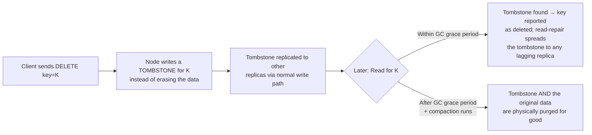
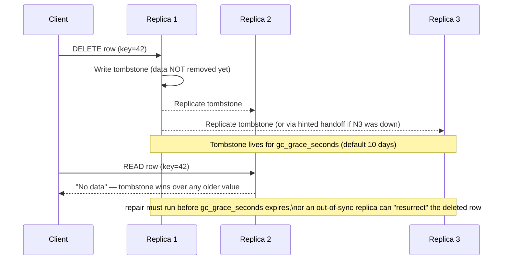
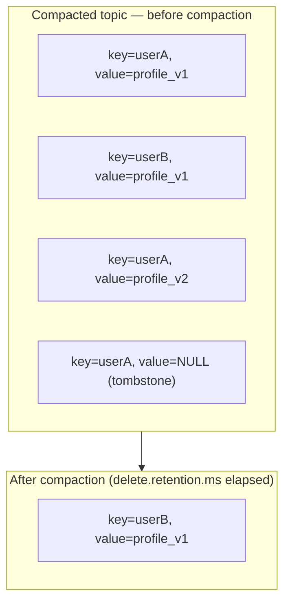

# Tombstones in Distributed Systems

A reference guide covering what tombstones are, why they exist, their trade-offs, and where they show up in real systems (Cassandra, Kafka, LSM-tree stores, CRDTs).

---

## 1. What Is a Tombstone?

A **tombstone** is a special marker written in place of data to record that the data was **deleted**, instead of physically removing it right away.

> Think of it like a gravestone: the person (data) is gone, but the marker stays behind so everyone who visits later knows "this used to exist, and it was intentionally removed" — as opposed to just being missing due to a bug, network partition, or replica that never got the write.

The key idea: **in distributed / append-only / immutable storage systems, you often cannot just "delete" a value cheaply and safely.** A tombstone converts a *destructive* delete into an *additive* write, which is much easier to replicate, order, and reason about.

---

## 2. Why Do We Need Tombstones? (The Delete Problem)

Two classes of systems make in-place deletion dangerous or impossible:

| System Type | Why plain delete is a problem |
|---|---|
| **Append-only / immutable storage** (LSM-trees: RocksDB, LevelDB, Cassandra SSTables, Kafka log segments) | Files on disk are immutable once written (for write speed). You can't reach into a sealed file and erase a row. |
| **Leaderless / eventually-consistent replication** (Cassandra, DynamoDB, Riak, CRDTs) | If Replica A deletes a row and Replica B was down, when B comes back with an *old copy* of the row, how does the cluster know B's data is stale garbage rather than a legitimate new write? Deleting the row on A leaves **no evidence** that a delete ever happened — B's stale write can "resurrect" deleted data. |

**Tombstones solve both problems**: instead of removing data, you write a new record saying *"key K is deleted, as of timestamp T."* This is just a normal write, so it:
- Fits naturally into append-only storage.
- Replicates through the exact same write/gossip/repair path as any other write.
- Carries a timestamp so last-write-wins / version comparison logic can decide "delete wins" vs "stale write loses."

---

## 3. Tombstone Lifecycle



**The critical window** is the gap between "delete is logically visible" and "delete is physically reclaimed." That gap exists on purpose — it gives slow/offline replicas time to receive the tombstone before it disappears forever.

---

## 4. Delete Path (Using a Tombstone)

The delete path is really just the [write path](../HighLevelSystemDesign/01_DesignKeyValueStore.md#9-component-5-write-path) carrying a special payload — there is no separate "delete pipeline." A `DELETE` is a `PUT` where the value is a tombstone marker instead of real data. That's the whole trick.

```
1. Client sends DELETE(key=K) to a node — same coordinator-selection logic
   as a normal write (hash key → walk ring → preference list)
2. Coordinator generates a NEW vector clock / timestamp for this write,
   descending the most recent version it knows of for K
3. Coordinator writes a TOMBSTONE(K, vclock/ts) — NOT a normal value —
   to itself and sends it to the other N-1 local replicas in parallel
4. Each local replica appends the tombstone to its WAL, applies it to its
   memtable (same durability path as any write), and ACKs
5. Coordinator waits for W acks (LOCAL_QUORUM in a multi-DC deployment)
6. On W acks → return SUCCESS (delete "confirmed") to client
7. Remaining local replicas + all REMOTE datacenters are updated
   ASYNCHRONOUSLY, off the client's critical path — exactly like the
   cross-DC write-replication stream
8. Tombstone sits in place of K's old value until gc_grace_seconds /
   delete.retention.ms elapses AND compaction runs — only then is the
   tombstone (and the value it shadows) physically purged
```

**Flow diagram** (N=3 per DC, W=2, LOCAL_QUORUM — client only waits on the local DC):

```
 Client        Coordinator(E2)      E1 (local)    E3 (local)     DC-West replicas
   │                 │                   │             │                 │
   │─ DELETE(K) ────▶│                   │             │                 │
   │                 │ new vclock/ts     │             │                 │
   │                 │ TOMBSTONE(K)      │             │                 │
   │                 │──WRITE(tombstone)▶│             │                 │
   │                 │──WRITE(tombstone)──────────────▶│                 │
   │                 │        WAL→memtable (both)      │                 │
   │                 │◀──── ACK ─────────│              │                 │
   │                 │  W=2 (E2+E1) reached → return    │                 │
   │◀── SUCCESS ─────│                   │             │                 │
   │                 │◀── ACK (async, no client wait) ──│                 │
   │                 │── async tombstone replication (disaster-recovery /
   │                 │   cross-DC stream, can take ms–seconds) ──────────▶│
```

### Example: reading the same key from a different geo-DC, before the tombstone replicates

Setup: `N=3` per DC (`DC-East`, `DC-West`), `LOCAL_QUORUM` W=2/R=2, async cross-DC replication (same model as the [multi-datacenter replication](../HighLevelSystemDesign/01_DesignKeyValueStore.md#multi-datacenter-replication) section).

```
t0   Key K = "profile:42" exists on all replicas in DC-East AND DC-West, value=v1

t1   Client A (routed to DC-East) sends DELETE(K)
     → coordinator E2 writes TOMBSTONE(K, vc={E:5}) to E1, E2, E3
     → LOCAL_QUORUM (W=2) reached on E1+E2 → SUCCESS returned to Client A
     → DC-East now reports K as deleted for any local reader

t2   (still in flight) E2 asynchronously forwards TOMBSTONE(K) toward DC-West's
     remote coordinator — this hop has NOT completed yet (cross-ocean latency,
     queued replication stream, or DC-West being temporarily unreachable)

t3   Client B (routed to DC-West, e.g. a user physically closer to that region)
     sends GET(K) → DC-West's LOCAL_QUORUM (R=2) is satisfied entirely by
     DC-West's own replicas (W1, W2, W3), which STILL hold value=v1 —
     they have no idea a delete ever happened

     → Client B receives v1, NOT "deleted"
```

**What just happened:** Client A was told the delete succeeded, but Client B — reading the *same key* from a different geo-DC microseconds later — sees the pre-delete value. This is a direct, expected consequence of `LOCAL_QUORUM`: the write only had to satisfy a quorum **within DC-East**; nothing about that quorum guarantees the tombstone has left the building yet. It is the delete-path mirror of the read-your-writes anomaly — here it's "read-your-deletes" that's violated across regions.

This is not a bug, it's the AP tradeoff made explicit (see the [PACELC framing](../HighLevelSystemDesign/01_DesignKeyValueStore.md#15-cap--pacelc-positioning) in the KV-store design): choosing `LOCAL_QUORUM` over a cross-DC quorum is choosing low latency and regional availability over global read-after-delete consistency. To close that window, a design would need `W` to span both DCs synchronously — which reintroduces the cross-ocean latency this replication model exists to avoid.

**How it eventually converges:**
- The async replication stream (or, if it's slow/stuck, background [Merkle-tree anti-entropy](../HighLevelSystemDesign/01_DesignKeyValueStore.md#12-component-8-anti-entropy-merkle-trees) diffing DC-East against DC-West) eventually delivers `TOMBSTONE(K, vc={E:5})` to `W1, W2, W3`.
- Because the tombstone's vector clock/timestamp causally descends (or is newer than) the `v1` it's overwriting, comparison logic resolves it as the winner — `v1` is shadowed the moment the tombstone lands, regardless of how it arrived (direct replication stream, read repair, or anti-entropy).
- Any GET(K) issued against DC-West *after* that point returns "not found."
- **Resurrection risk to watch for:** if conflict resolution here were pure last-write-wins driven by loosely synchronized wall clocks, a sufficiently skewed clock on `E2` (tombstone writer) could make the tombstone's timestamp appear *older* than `v1`'s, causing the tombstone to lose the comparison and `v1` to "win" — permanently un-deleting K. This is exactly why the [vector-clock / conflict-resolution](../HighLevelSystemDesign/01_DesignKeyValueStore.md#8-component-4-conflict-resolution) discipline (or well-bounded NTP skew, if using LWW) has to hold for deletes just as strictly as it does for ordinary writes.

---

## 5. Types of Tombstones

| Type | Granularity | Example |
|---|---|---|
| **Cell / column tombstone** | One field in one row | `UPDATE users SET email = null WHERE id = 5` in Cassandra |
| **Row tombstone** | Entire row | `DELETE FROM users WHERE id = 5` |
| **Range tombstone** | A contiguous range of rows/clustering keys | `DELETE FROM events WHERE user_id = 5 AND ts < '2026-01-01'` |
| **Partition tombstone** | An entire partition | `DELETE FROM events WHERE user_id = 5` |
| **Message tombstone (log-based)** | A key in a log/stream | Kafka compacted-topic record with `value = null` |

---

## 6. Where Tombstones Are Used

| System | How tombstones show up |
|---|---|
| **Apache Cassandra / ScyllaDB** | `DELETE` writes a tombstone cell/row/range; purged after `gc_grace_seconds` (default 10 days) once compaction runs |
| **Kafka (compacted topics)** | Producing a record with `value = null` for a key marks it for removal; retained for `delete.retention.ms`, then dropped on next compaction |
| **HBase** | `Delete` mutations write a `KeyValue` with type `Delete`/`DeleteColumn`/`DeleteFamily`, resolved during major compaction |
| **RocksDB / LevelDB (any LSM engine)** | Internal delete markers per key, dropped when compaction merges the SSTable containing them with the SSTable containing the original value |
| **DynamoDB Streams / Global Tables** | Emits tombstone-like `REMOVE` records so cross-region replicas and downstream consumers converge |
| **CRDTs** (e.g., OR-Set, 2P-Set) | An element is "removed" by recording it in a tombstone/remove-set, so concurrent add/remove operations from different nodes still converge deterministically |
| **S3 (versioned buckets)** | A "delete marker" is inserted as the current version instead of removing prior object versions |
| **Android OS** *(different meaning — worth knowing so you don't conflate it in an interview)* | A "tombstone" file is a crash-dump/stack-trace snapshot written when a native process crashes — unrelated to the delete-marker concept above |

### Cassandra delete + read walkthrough



### Kafka log-compaction tombstone



---

## 7. Pros and Cons

| ✅ Pros | ❌ Cons |
|---|---|
| Deletes replicate through the same write path — no special coordination needed | Consume storage until compaction/GC actually runs |
| Prevents stale-write "resurrection" of deleted data on lagging replicas | Reads must skip over tombstones → read amplification / latency |
| Plays naturally with append-only, immutable storage (no in-place erase needed) | Cassandra can outright **fail a query** past `tombstone_failure_threshold` (default 100,000 scanned) |
| Timestamp on the tombstone lets last-write-wins logic resolve delete vs. concurrent write | Space isn't reclaimed until `gc_grace_seconds`/`delete.retention.ms` passes **and** a compaction runs |
| Works well with async/gossip replication and hinted handoff | Adds JVM heap/GC pressure in Java-based stores (Cassandra, HBase) holding tombstones in memtables/caches |
| Enables safe convergence in CRDTs despite concurrent add/remove | Requires careful data modeling — high-churn "delete-heavy" patterns (e.g., using Cassandra as a queue) are a well-known anti-pattern |
| Gives a window for consistency repair before data is gone forever | Extra operational tuning: `gc_grace_seconds` vs. repair cadence must be kept in sync, or deleted data can silently reappear |

---

## 8. Tombstone vs. Soft Delete vs. Hard Delete

| | **Hard delete** | **Soft delete** (RDBMS `is_deleted` flag) | **Tombstone** |
|---|---|---|---|
| Data physically removed? | Immediately | No — flag flips, row stays | No — marker written, purge deferred |
| Where typically used | Single-node RDBMS, non-replicated stores | Single-node RDBMS with audit/undo needs | Distributed / leaderless / log-based / immutable storage |
| Safe under async replication? | ❌ No evidence of delete propagates | ⚠️ Only if the flag update itself replicates reliably | ✅ Yes — that's the whole point |
| Read overhead | None | Small (extra `WHERE is_deleted = false`) | Can be significant at scale (scanning/merging tombstones) |
| Space reclaimed | Immediately | Only via an explicit cleanup job | Only after GC-grace window + compaction |
| Failure mode if misused | Data gone, no undo | Table bloat over time | Tombstone bloat → read failures/latency |

---

## 9. The Tombstone Accumulation Problem (Cassandra example)

This is the interview-relevant "gotcha" most engineers hit in production:

1. A partition receives many `DELETE`s (e.g., using Cassandra like a queue: insert → process → delete).
2. Each delete adds a tombstone to that partition.
3. A single read now has to **scan past thousands of tombstones** before finding live data.
4. Cassandra logs a warning past `tombstone_warn_threshold` (1,000) and **throws a `ReadTimeoutException`/fails the query** past `tombstone_failure_threshold` (100,000).

**Mitigations:**
- Avoid data models that require heavy per-row deletes on the same partition (use TTLs to expire data instead of explicit deletes, when possible).
- Keep `gc_grace_seconds` aligned with your repair schedule — repairs must complete *before* grace period expiry, or a node that missed the tombstone can resurrect deleted data.
- Monitor tombstone counts (`nodetool cfstats`, tombstone-scan metrics) proactively.
- Tune compaction strategy (STCS vs. LCS vs. TWCS) to match the write/delete pattern.
- For Kafka: size `delete.retention.ms` so all consumers have had a chance to observe the tombstone before it's compacted away.

---

## 10. Minimal Code Illustrations

**LSM-style tombstone marker (conceptual, Java):**
```java
class Entry {
    byte[] key;
    byte[] value;     // null == this entry IS a tombstone
    long timestamp;

    boolean isTombstone() {
        return value == null;
    }
}

// A "delete" is just a normal write with a null value
memtable.put(key, new Entry(key, /* value */ null, System.currentTimeMillis()));

// During compaction, once past the GC-grace window, tombstones
// AND the values they shadow are dropped from the merged SSTable.
```

**Kafka tombstone (compacted topic):**
```java
// Deleting key "user-42" from a log-compacted topic:
producer.send(new ProducerRecord<>("user-profiles", "user-42", null));
```

---

## 11. Interview Cheat Sheet

If asked *"how do you handle deletes in a distributed / eventually consistent system?"*:

1. Say plainly: **don't delete in place — write a tombstone.**
2. Explain *why*: prevents stale replicas from resurrecting deleted data; fits append-only storage.
3. Mention the **trade-off**: storage/read overhead until compaction reclaims space — this is the "cost" of correctness under replication.
4. Name the **failure mode** to show depth: tombstone accumulation causing read timeouts (Cassandra), and the repair-vs-gc_grace_seconds race condition.
5. Contrast with **soft delete** (fine for a single-node RDBMS, insufficient once you have leaderless replication) to show you know when tombstones are actually necessary vs. overkill.

---

### Quick Recap
- **Tombstone** = a marker recording "this was deleted," not an actual erase.
- Needed because **immutable storage** and **leaderless replication** both make true in-place deletes unsafe or impossible.
- Used in Cassandra, Kafka (compacted topics), HBase, RocksDB/LevelDB, DynamoDB replication, CRDTs, S3 versioning.
- Biggest real-world risk: **tombstone accumulation** hurting read performance — manage via TTLs, compaction tuning, and keeping repair cycles ahead of GC-grace expiry.
